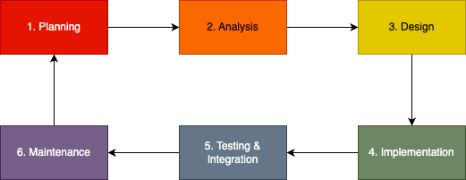
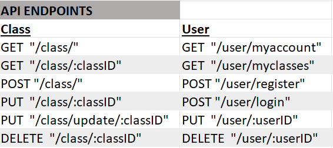

# Tony Le Huynh and Johnson Wang

## *Roids Fitness: MERN Full Stack Application*

## Links
- [Github Repo](https://github.com/orgs/Roids-Fitness/repositories)
- [Frontend (Vercel)](https://roids-fitness.vercel.app/)
- [Backend (Heroku)](https://roids-fitness-server-c1145ebc83e7.herokuapp.com/)

## Purpose

The purpose of this application is to serve as a calendar scheduling and booking system for a gym and its weekly classes. 

This application will allow gym patrons to view the weekly scheduled classes at the gym through an online calendar system, as well as make bookings for these classes. Along with this, gym staff and trainers will also be able to utilize the application to add additional classes to the calendar. 

It has been discussed with local gym business Roids Fitness to help transition their gym weekly classes system from paper to online. Developers working on this project are Johnson Wang and Tony Le Huynh. Before working with us, Roids Fitness only displayed their weekly classes on a whiteboard and sheets of paper at the gym. Gym patrons could only view the classes that were held by having to physically go to the gym to check, and could only book at the front office. By building this application, this will benefit both the gym patrons by making their customer experience much better as well as reducing workload for the staff as patrons can easily book classes online rather than having to see a staff member in person. 

Gym patrons will have their own user accounts where they can view the online gym class schedule, make bookings, as well as see a list of the classes they’ve booked for on their own dashboard. Gym staff and trainers will also have their own accounts where they can add classes as well as see a schedule of the specific classes that they’ll be hosting for the next week or fortnight. 

## Installation instructions

Ensure to run ```npm install``` to install all dependencies for both front-end and back-end

**Front-end**
1. In terminal after cloning repository, run ```npm run start``` to create application in development mode.

**Backend-end**
1. In terminal after cloning repository, run ```npm run dev``` to create server in development mode
2. Also run ```npm run wipe-and-seed``` to wipe then seed the local MongoDB database with data for development

## Target Audience

The target audience for the application will be the patrons for the gym Roids Fitness. 

There are a wide range of demographics who attend the gym classes at Roids Fitness. According to employees, these include:

- Young teenagers between the ages 15-17
- Young adult men and women
- Middle-aged men and women
- Senior men and women

There are a variety of reasons patrons attend these classes including for health reasons as well as being a means to socialize. 

The application will need to be simple and intuitive to use so that it is easily accessible for all the gym patrons. 

## User Stories
The user stories that have been met by the project outcome are checked below.

__Core MVP features:__

- [x] As a gym patron, I want to see a clear calendar displaying the schedule of gym classes for the next few weeks, as I want to be able to make a quick decision on which class I want to attend. 
- [x] As a gym patron, I want to be able to easily book a class online so that I can attend this class. 
- [x] As a gym patron, an online dashboard showing a list of the classes I’ve booked would be really handy so that I can remember what classes I intend to attend. 
- [x] As a gym patron, I would like to create an account for myself and login, so that I can both book these classes as well as see a dashboard showing my details and lists of classes I’ve booked. 
- [ ] As a gym staff member, I need to be able to add new classes to the calendar schedule so that the classes available remain up to date for our patrons to see.

__Additional features:__

- [x] As a gym patron, I would like to see further details regarding the classes offered at my gym. This is so that I can make a decision on which classes I would like to attend and so that I also know if I need to bring any additional equipment (such as a yoga mat, shoes, towel etc.) to the class. 
- [ ] As a gym patron, I would like to be able to filter the gym class schedule by types of classes and trainers. This is so that I can see specifically which classes I want to attend. 
- [ ] As a gym staff member and trainer, I want to be able to see a roster of the specific classes that I’ll be taking for the week. This is so that I clearly know what classes I’ll be taking, and so that I can personally plan and prepare for these classes.


__After consultation with Roids Fitness__

After a second consultation with Roids Fitness regarding the plan for the features and development of the application, it was requested by the business to include additional admin/manager functionality to do things such as remove employees and classes. 

- [ ] As a gym staff member, I want to also be able to edit or remove any classes from the schedule in case there are any changes such as a trainer no longer being available. 
- [ ] As a gym staff member, I should be able to create my own account and login so that I can add/edit/remove classes to the schedule. 
- [ ] As the manager and admin user, I want to be able to add and remove gym staff from the system so that the users that have access to the calendar application are up to date. 


__Further market research__

Upon some further market research of other applications and systems used by gym businesses, there were a few more aspects of functionality that could be added to the application. This would be dependent on project deadlines as well as budget. 


- [ ] As a gym patron, I would like to be able to purchase individual PT sessions for myself as opposed to just attending classes so that I can have a one-on-one experience and guidance with my training. 
- [ ] As a gym patron I would like to be able to update and see my details in my user account. This is so that I can keep these details up to date for my gym membership. 
- [ ] As a gym patron, I would like to be able to purchase the products on offer at the gym online. This is so that I’m not limited to only being able to purchase these products at the gym. 
- [ ] As a gym staff member, I want to be able to display and sell the gym’s products online. This is so that our patrons can see the fantastic products we have on offer such as supplements. 


## Functionality & Features

The core MVP features of the application will include:

1. Weekly calendar to display current available classes at the gym
2. Login + Signup account functionality for gym patrons
3. Display of a list of classes booked by the individual gym patrons, shown through a dashboard and their user account
Booking system for the classes to be utilized by gym patrons

All users will be required to be authenticated and to login via the same login page. From there, they will access their own user accounts with the functionality of gym staff and gym patrons being different. Gym patrons will be able to make bookings for classes as well as see a list of classes that they’ve currently booked, whilst gym staff will be able to create classes on the calendar schedule. 

Other additional features which can be implemented further along in the development/deployment process will include:

1. Login + Signup account functionality for admin users and gym staff
2. Adding classes to the weekly calendar (functionality available to only admin users/gym staff in the system). Classes should also be able to be edited and removed by gym staff/admin users. 
3. Booking system for gym patrons to schedule and purchase individual PT (personal training) sessions. 
4. Functionality to click on individual classes/slots in the calendar which will display further information about the class such as type of class, a short description, whether there is any required equipment to bring to class etc. This functionality can also be replaced by a dedicated section or page on the application/website which will provide a description of the classes on offer at the gym. 
5. Filtering option for the weekly calendar. Classes displayed can be filtered by aspects such as trainers, the type of class, level of difficulty etc. 

Depending on project deadlines as well as available resources and budget, these are some further features that could be implemented to add to the application:

- Section in the user dashboard to store details of the gym patron such as name, age, contact details, address, current gym membership etc. 
- Weekly roster functionality for gym staff/trainer accounts which will display the schedule of classes they are taking
- A further e-commerce section for the website for the gym to display and sell their products such as supplements and equipment

## Task Delegation Methodology
Kanban is a project management tool used to visualise progress and encourages steady output. It is a board where tasks are listed on cards and moved along the board until it reaches the “Done” column.

The Kanban board would be created in Trello in the following [link](https://trello.com/invite/b/7ynXsY0G/ATTIad1612a188a0b08b5e2f737cda51edb54F40A231/trello-board). This platform would be used to delegate, provide updates and give feedback on a particular task. On top of that, daily stand up meetings were conducted via Discord and Zoom which served as check-ins for each team member's progress as well as an opportunity for questions..

At the start of the project, a scrum was conducted for the brainstorming of ideas and businesses to work with. During this time, a Trello board was also created where ideas would be commented on and stored on a card. Once the project idea was finalized, tasks were created and allocated on the Trello board. Each team member was responsible for completing and adding any new tasks, with the other checking each other’s work once a task was moved to the “Review” stage.

__Trello Board at project start:__
%20.png)

__Trello Board at project part A end:__
.png)

__Trello Board at project part B end:__
.png)

Below is a close look at a card that has utilised quite a few functionality on Trello (highlighted with numbers):
1. Clearly defined title of the task
2. The assigned members to the card
3. Label specifying the type of task in relation to the project
4. The expected completion date for the card
5. Brief description or information related to the task
6. Checklist to help with completion of the task
7. Comment section where updates and feedback are provided


Additional features were unlocked later on in the project.
8. Github Power-ups that allow pull request, commits and branches to be attached to cards.
9. Additional labels to show the difficulty of the task.
10. Story points which are the number of the sprint.
11. Recorded completion date when the task is completed.

.png)

As evident by the Trello cards, the task delegation for this application were as followed:

- Frontend build and testing - Johnson
- Backend build and testing - Tony
- Integration - Both through pair programming
- Documentation - Johnson

The task delegation plays on the strengths and weaknesses of the team. Johnson is shown to have a keener eye for aesthetics when building the wireframes, making him a more suitable candidate for building the frontend. He also plans to focus on the frontend for his career plans and this provides the perfect opportunity. Tony, on the other hand, felt he was more comfortable building the backend as he grasps the concepts much better. The choice of separating the tasks as so was purposeful, as both developers have very distinctive styles when it comes to programming and felt that work can be conducted more efficient independently. During integration, pair programming was conducted giving both developer a chance to teach and learn.

## Project Management Methodology
The Roids Fitness Application was created following the Agile Software Development Cycle.



Work is outputted in mini cycles of planning, implementation, review and retrospectives called sprints. Within each sprint, a meeting is held with the stakeholders to discuss the project progress and the Kanban board is re-populated with new tasks that need to be completed for the week. Ideally at the end of each week, all the tasks specified for that week would be in the “Done” section.

The following were the sprints and their descriptions. These are identified by the Story Points in the Trello Board.

1. Project planning: website description, user stories, Trello board planning and dataflow diagram.

2. Project planning and design: application architecture diagram, git workflow planning and wireframes.

3. Project design and implementation: frontend Bootstrap and CSS, initial frontend deployment and backend routes planning

4. Project implementation: frontend registration and login page form, backend database seed file, backend models, backend JWT and backend admin functionality.

5. Project implementation (integration start): register form data integration, backend deployment, fixing routes to match, local database testing and frontend login integration.

6. Project implementation (integration): frontend calendar, frontend signup to class, backend code tidying

7. Project implementation (final) and testing: frontend code tidy-up and backend and frontend testing

8. Project maintenance and documentation: documentation, development and production testing and presentation.

## Dataflow Diagram

Below diagram shows the flow of data within the application related to user processes.


## Application Architecture Diagram 

Below diagram shows the tech stack related to this application and how they interact to serve client's browser.


*Note that the final frontend deployment was on Vercel instead of Netlify due to technical issues.

This diagram is a more detailed look at what data is served on each web page of the application along with navigation at the frontend.


## Wireframes

__Homepage__

This is the homepage of the application. There is an image slideshow that show various exercises and classes available in the gym.

Desktop:
.png)

Mobile:

.png)

__Login Page__

Simple form component for users to sign in.

Desktop:
.png)

Mobile:

.png)

__Register Page__

Simple form component for users to register a new account.

Desktop:
.png)

Mobile:

.png)

__Calendar Page__

Page with calendar functionality showing the class schedule for the gym. Users do not have to login to view this page except there are filter options dor "All" and "My Classes" for logged in users. Classes that are in the past, would not be able to be signed up.

Desktop:
.png)

Mobile:

.png)

__Class Details Page__

Page that will open up when user clicks on a class. It will display the details of the class as well as an option to book to attend the class.

Desktop:
.png)

Mobile:

.png)

__Confirmation Page__

Page that will display confirmation of the user's booking for the class.

Desktop:
.png)

Mobile:

.png) 

__Add Class Page__

Feature available only to admin users/gym employees where they will be able to add new classes which will be displayed on the gym class schedule calendar.

Desktop:
.png)

Mobile:

.png)

## Tech Stack

__Front-end:__ React.JS, HTML, CSS, JavaScript, Bootstrap

__Back-end:__ Node.js, Express.js

__Database:__ MongoDB, Mongo Atlas, Mongoose

__Deployment:__ Netlify / Vercel (Front-end), Heroku (Back-end)

__Testing:__ Jest

__Project-management tools:__ Trello, Discord, Zoom, In-person pair-programming + meetings

__Utilities:__ Draw.io, Figma, Google docs

## Libraries
The following libraries were used for the Roids Fitness Application. Below a brief description is given, followed by its use in the application.

1. @daypilot/daypilot-lite-react: A lightweight event calendar and scheduling solution in the form of React components. Used to generate the timetable/calendar component for the application.

2. @testing-library/jest-dom: Custom matchers for Jest to extend DOM-related testing capabilities that simplifies testing React components' output. Used for testing.

3. @testing-library/react: Utility library for testing React components from a user's perspective. Used for testing in the frontend.

4. @testing-library/user-event: Utility library for simulating user interactions with React components during testing. Used for testing in the frontend.

5. axios: HTTP client library for making API requests in JavaScript. Allows the frontend to exchange data from the backend.

6. bootstrap: Comprehensive CSS framework with pre-built components for responsive web interfaces. Used to "pretty-up" the UI. Pre-designed components include things such as navigation bars, modals, and alerts, reducing the time spent on styling and ensuring consistency across the application. 

7. dotenv: Loads environment variables from a .env file into Node.js applications. Used to store database connection URL and JWT secret key. Also manages environment-specific configuration to keep sensitive data secure

8. enzyme: React testing utility with capabilities for rendering and manipulating components. Used for testing in the frontend.

9. enzyme-to-json: Serializer for Enzyme wrappers to enable snapshot testing of React components. Used for testing in the frontend.

10. helmet: Express.js middleware for securing web applications by setting HTTP headers. Used for security in the backend.

11. react: JavaScript library for building user interfaces and single-page applications. React has a component-based architecture, which enables developers to create reusable and self-contained UI components. By using a virtual DOM (Document Object Model), React ensures efficient and optimised rendering of these components. Within the Roids Fitness Application, React forms the foundation of the frontend, allowing for a dynamic and responsive user experience.

12. react-bootstrap: React components implementing the Bootstrap CSS framework. Used to create components in frontend with existing styling built-in.

13. react-dom: Provides DOM-specific methods for rendering React components. Used for rendering frontend.

14. react-helmet: React component for dynamically setting document head metadata. Used to generate window titles for the frontend.

15. react-router-dom: Library for client-side routing and navigation in React applications. Used to allow frontend navigation between pages.

16. react-scripts: Configuration and scripts for bootstrapping and running React applications. Used to generate terminal commands for running the application.

17. react-svg: React component library for using SVG images in JSX code. Used for adding the logo.svg to the application.

18. web-vitals: Library for measuring essential web performance metrics.

19. bcrypt: Library for hashing and salting passwords in Node.js. Used to encrypt user passwords in the backend.

20. cors: Express.js middleware for enabling Cross-Origin Resource Sharing.

21. express: Web application framework for Node.js. Allows developers to easily integrate various middlewares based on the application's needs. These middlewares offer a wide range of functionalities which include parsing incoming request bodies to handling routes and managing authentication. Within the Roids Fitness Application's backend, Express handles routing, data processing, and communication with the databases, serving as the backbone for server-side operations.

22. jsonwebtoken: Library for generating and verifying JSON Web Tokens (JWTs). Used to generate user tokens when users login.

23. moment-timezone: Library extending Moment.js to support working with time zones. Provides robust timezone handling in JavaScript, ensuring consistent date-time representation across various time zones. When storing data from the backend to the database, date and time objects are converted to UTC when converted to BSON. This is used to correctly store time in AEST.

24. mongoose: Object Data Modeling (ODM) library for MongoDB and Node.js. Allows the connection between express and MongoDB.

## User Testing
Extensive Manual (user) testing was conducted through an evaluation form regarding the production and development aspect of the application. A total of 4 users completed the form, with the result show [here](https://docs.google.com/document/d/18ZbZ0F2ufvr-sh_u9Xq0s8Zapyr7ALS0006KmKZKaX0/edit).


Points of feedback were provided on this form for the application (feedback received by both testing completed by developers & the client Roids Fitness). Throughout development, consistent communication was maintained between developers and the client via Zoom & In-Person meetings. This allowed for the client to be kept up to date with the project timeline and outcome as well as the developers to implement any feedback provided by the client within the time constraints of the project. Any feedback that was unable to be implemented due to project, budget and time limitations were clearly discussed with the client via Zoom/In-person meetings. Priority of the development phase was to deliver the client with a functional application satisfying core MVP features. 

**Backend Server Testing**

Extensive testing of all backend webserver routes were completed via Postman. Each route was manually tested for input validation, graceful error handling and for valid server responses.

There were some API routes that weren't utilised by the front-end due to time constraints. However these routes were kept in the backend for future application scalability and further development. 

Listed below are all API endpoints for the application:



A spreadsheet was created to track the testing of all API routes. Manual testing of each route was done by both developers and the results are shown [here](https://docs.google.com/spreadsheets/d/1OKOc6_ROvpB-TmJC04GvhUnCWOLzc5rxdsKKd8YpHoU/edit?usp=sharing).

Each route was tested to ensure that it would response as intended when provided with valid inputs. If the route required a JWT token, then this was also tested to ensure that the request would not be successful without a valid JWT. If the route required the JWT to be from an admin user, this was also tested to ensure this was the case for proper user admin authentication. Successful user registration and login was tested as well as JWT generation for authentication. Any feedback during the testing of the routes was discussed over Zoom/In-person/or noted on a Trello card. Correction to application code was done accordingly to ensure errors and inputs were successfully handled. 

Invalid inputs were also tested and it was ensured that the appropriate error status codes and responses were handled to ensure graceful error handling and server response. Invalid inputs included wrong passwords, wrong formats, missing fields (i.e. email or password) , wrong date formats etc. If data was to be provided by the server to the front-end, this was tested to ensure this was done successfully for both local MongoDb as well as cloud Mongo Atlas (i.e. all classes were provided correctly by the server so that these would be displayed correctly on the class timetable page).


## Project Outcome
The main project outcome was that the MVP features were achieved. Within the project's time contraints, the user stories for the core MVP features were all satisfied - with users being able to register for an account and log in. Users are also able to view the weekly classes timetable along with being able to sign up for these classes. 

On the frontend, the home page, register page, login page, calendar page and the class details page were completed. On the backend, routes were completed for creating class, updating class, deleting class, retrieve user by id, updating user and deleting user in additional to the functionality of the frontend which were:
- creating user - register page
- user authentication - login page and logout functionality
- getting classes - calendar page
- updating participantList and updating savedClasses - class detail signup page
- getting classes by id - class details page

Through the user production testing phase, most of the stakeholders were satisfied with the full-stack application, given that it meets the minimal requirement for Roids Fitness' business use. User-interface was also kept minimal to allow for a simple and intuitive user experience, as requested by Roids Fitness. 


Some feedback were given to improve the calendar UI for a more professional look and others say that the amount of features felt lackluster and wished for more.

Due to time restraints, many of the additional features could not be completed. An additional 2 months was proposed by the development team to complete the fully fledged app with financial compensation to be discussed with Roids Fitness. The 2-month project plan proposes:
- Admin functionality to create and modify classes
- User update details
- Filtering options on the calendar
- Added security through better encryption and secure cloud storage
